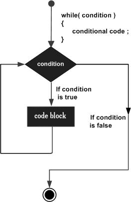
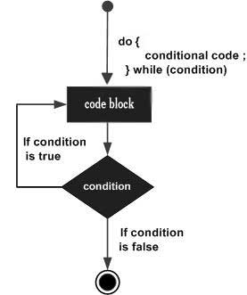
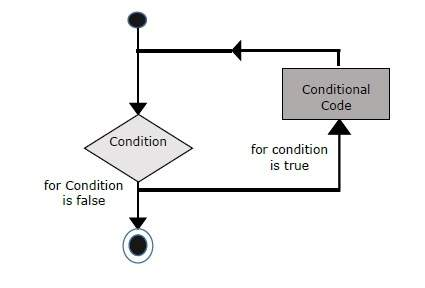
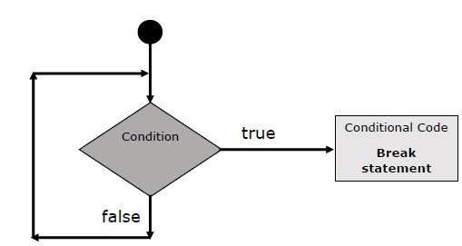

<div align="center">
  <h1> 100 Days Of Solidity: Loops</h1>
  <a class="header-badge" target="_blank" href="https://dev.to/envoy_">
  
  </a>
  <a class="header-badge" target="_blank" href="https://twitter.com/Envoy_1084">
  
  </a>

<sub>Author:
<a href="https://dev.to/envoy_" target="_blank">Vedant Chainani</a><br>
<small> June, 2022</small>
</sub>
</div>

[<< Day 7](../Day%20007%20-%20Functions/readme.md) | [Day 9 >>](../Day%20009%20-%20Decision%20Making/readme.md)


---

# 📔 Day 8

## While Loop

The purpose of a while loop is to execute a statement or code block repeatedly as long as an expression is true. Once the expression becomes false, the loop terminates.



### **Syntax** -
  
```solidity
while (expression) {
  Statement(s) to be executed if expression is true
}
```
Example:

```solidity
// SPDX-License-Identifier: MIT
pragma solidity ^0.8.7;

contract MyContract {
   uint8 j = 0;
   uint public num = 2;

   function whileLoop() public returns(uint) {
      while (j < 5) {
         j++;
         num *= 2;
      }
      return num;
   }
}
```

Here the value of num at end of execution of while loop is `64`

---

## Do-While Loop

The do...while loop is similar to the while loop except that the condition check happens at the end of the loop. This means that the loop will always be executed at least once, even if the condition is false.



### **Syntax** -

```solidity
do {
Statement(s) to be executed;
} while (expression);
```

Example:

```solidity
// SPDX-License-Identifier: MIT
pragma solidity ^0.8.7;

contract MyContract {
    uint8 j = 0;
    uint256 public num = 2;

    function doWhile() public returns (uint256) {
        do {
            j++;
            num *= 2;
        } while (j < 5);
        return num;
    }
}
```
Here the value of num at end of execution of do-while loop is `64`

---

## For Loop

The for loop is the most compact form of looping. It includes the following three important parts −

- The loop initialization where we initialize our counter to a starting value. The initialization statement is executed before the loop begins.
- The test statement which will test if a given condition is true or not. If the condition is true, then the code given inside the loop will be executed, otherwise the control will come out of the loop.
- The iteration statement where you can increase or decrease your counter.



### **Syntax** -

```solidity
for (initialization; test condition; iteration statement) {
  Statement(s) to be executed if test condition is true
}
```

Example:

```solidity
// SPDX-License-Identifier: MIT
pragma solidity ^0.8.7;

contract MyContract {
    uint8 j = 0;
    uint256 public num = 2;

    function forLoop() public returns (uint256) {
        for (uint j = 0; j < 5; j++) {
            num = num * 2;
        }
    }
}
```

Here the value of num at end of execution of for loop is `64`

---

## The break Statement

The break statement, which was briefly introduced with the switch statement, is used to exit a loop early, breaking out of the enclosing curly braces.



Example:

```solidity
// SPDX-License-Identifier: MIT
pragma solidity ^0.8.7;

contract MyContract {
    uint8 j = 0;
    uint256 public num = 2;

    function breakStatement() public returns (uint256) {
        for (uint256 j = 0; j < 5; j++) {
            if (j == 3) {
                break;
            }
            num = num * 2;
        }
        return num;
    }
}
```

Here the value of num at end of execution of for loop is `16`

---

[<< Day 7](../Day%20007%20-%20Functions/readme.md) | [Day 9 >>](../Day%20009%20-%20Decision%20Making/readme.md)
