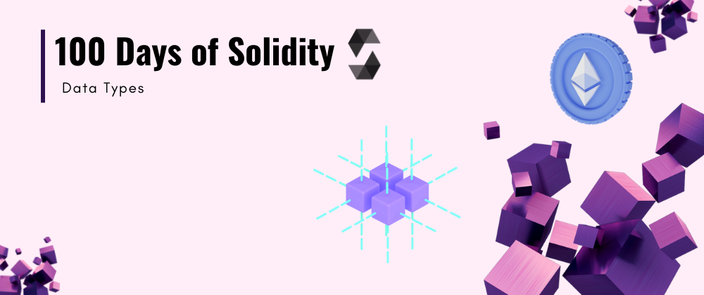

<div align="center">
  <h1> 100 Days Of Solidity: Data Types</h1>
  <a class="header-badge" target="_blank" href="https://dev.to/envoy_">
  
  </a>
  <a class="header-badge" target="_blank" href="https://twitter.com/Envoy_1084">
  
  </a>

<sub>Author:
<a href="https://dev.to/envoy_" target="_blank">Vedant Chainani</a><br>
<small> June, 2022</small>
</sub>
</div>

[<< Day 5](../Day%205%20-%20Operators/readme.md) | [Day 7 >>](../Day%207%20-%20Functions/readme.md)



---

# 📔 Day 6


## Data Types

Solidity offers the programmer a rich assortment of built-in as well as user defined data types. Following table lists down seven basic C++ data types −

| Type                |     Keyword      | Values                                                                                                                                                                                                                 |
| ------------------- |:----------------:| ---------------------------------------------------------------------------------------------------------------------------------------------------------------------------------------------------------------------- |
| Boolean             |       bool       | true/false                                                                                                                                                                                                             |
| Integer             |     int/uint     | Signed and unsigned integers of varying sizes.                                                                                                                                                                         |
| Integer             |  int8 to int256  | Signed int from 8 bits to 256 bits. int256 is the same as int.                                                                                                                                                         |
| Integer             | uint8 to uint256 | Unsigned int from 8 bits to 256 bits. uint256 is the same as uint.                                                                                                                                                     |
| Fixed Point Numbers |  fixed/ufixed   | Signed and unsigned fixed point numbers of varying sizes.                                                                                                                                                              |
| Fixed Point Numbers |     fixedMxN     | Signed fixed point number where `M` represents number of bits taken by type and `N` represents the decimal points. M should be divisible by 8 and goes from 8 to 256. N can be from 0 to 80. fixed is same as fixed128x18. |
| Hexadecimal | address | Holds a 20 byte value (size of an Ethereum address). |


example -

```solidity
// SPDX-License-Identifier: MIT

pragma solidity ^0.8.7;

contract MyTypes {
    bool myBool = true; // if bool value is not specified then it is false by default

    // Unsigned Integers - can only take 0 or positive values range =  0 - (2^n - 1)
    uint8 myUint8 = 84; // 0 - 255
    uint16 myUint16 = 1458; // 0 - (2^16 -1)
    uint256 myUint256 = 47452848525; // uint goes from 8 to 256 taking steps of 8 and can hold max number which is equal to ( 2^n -1 )

    // Signed Integers - can take negative as well as positive values Range = (-2^(n-1),2^n - 1)
    int8 myInt8 = -114; // -128 - 255
    int16 myInt16 = -1458; // 0 - (2^16 -1)
    int256 myInt256 = 47452848525; // int goes from 8 to 256 taking steps of 8

    // address - Holds a 20 byte value (size of an Ethereum address).
    // address refers to a smart contract address
    // address payable refers to a wallet address which can recieve or send funds
    address myAddress; //Defaults to 0x0000000000000000000000000000000000000000
    address public smartAddress = address(0x7EF2e0048f5bAeDe046f6BF797943daF4ED8CB47);
    address payable walletAddress = payable(0xBF4979305B43B0eB5Bb6a5C67ffB89408803d3e1);
}
```

---
[<< Day 5](../Day%205%20-%20Operators/readme.md) | [Day 7 >>](../Day%207%20-%20Functions/readme.md)
