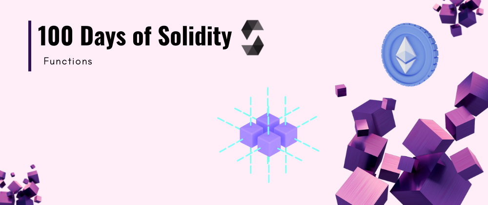

<div align="center">
  <h1> 100 Days Of Solidity: Functions</h1>
  <a class="header-badge" target="_blank" href="https://dev.to/envoy_">
  
  </a>
  <a class="header-badge" target="_blank" href="https://twitter.com/Envoy_1084">
  
  </a>

<sub>Author:
<a href="https://dev.to/envoy_" target="_blank">Vedant Chainani</a><br>
<small> June, 2022</small>
</sub>
</div>

[<< Day 6](../Day%206%20-%20Types/readme.md) | [Day 8 >>](../Day%207%20-%20Loops/readme.md)



---

# 📔 Day 7

## Functions

A function is basically a group of code that can be reused anywhere in the program, which generally saves the excessive use of memory and decreases the runtime of the program. Creating a function reduces the need of writing the same code over and over again.

Syntax -
```solidity
function function_name(parameter_list) scope returns(return_type) {
       // block of code
}
```

eg-

```solidity
// SPDX-License-Identifier: MIT
pragma solidity ^0.8.7;

contract MyContract {
    function add() public view returns (uint256) {
        uint256 num1 = 10;
        uint256 num2 = 16;
        uint256 sum = num1 + num2;
        return sum;
    }

    function sqrt(uint256 num) public pure returns (uint256) {
        num = num**2;
        return num;
    }
}
```

`view` in a function ensures that they will not modify the state of the function.

---

[<< Day 6](../Day%206%20-%20Types/readme.md) | [Day 8 >>](../Day%207%20-%20Loops/readme.md)
