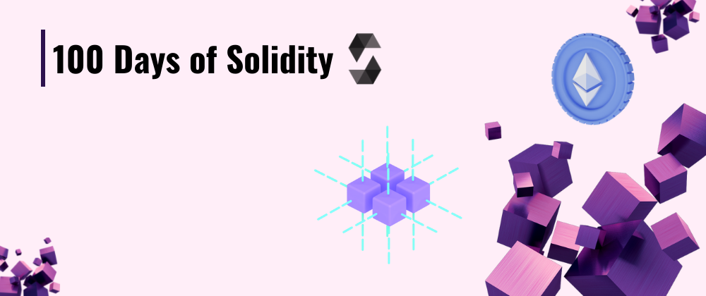

---

## Contents

- [Day 1 - Licences and Pragma](./Day%201%20-%20Licences%20and%20Pragma/readme.md)
- [Day 2 - Comments](./Day%202%20-%20Comments/readme.md)
- [Day 3 - Initializing Basic Contract and Types](./Day%203%20-%20Initializing%20Basic%20Contract%20and%20Types/readme.md)
- [Day 4 - Variables and Scopes](./Day%204%20-%20Variables%20and%20Scopes/readme.md)
- [Day 5 - Operators](./Day%205%20-%20Operators/readme.md)
